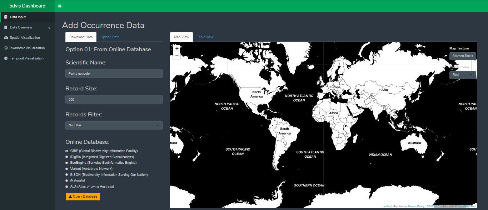
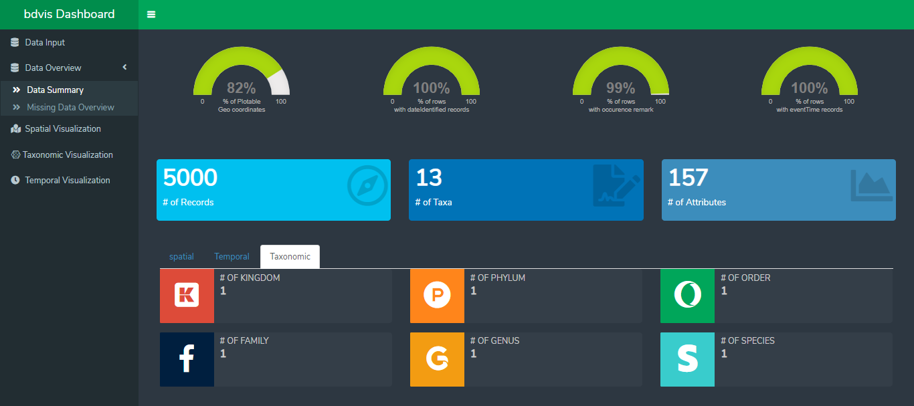
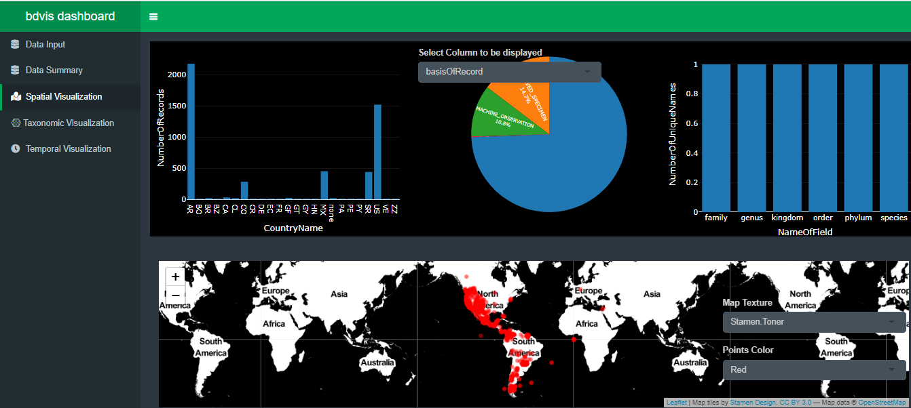
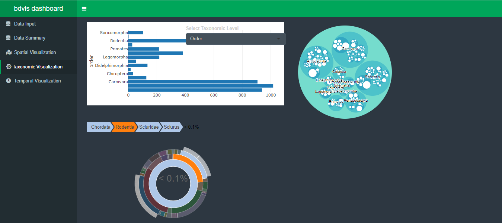
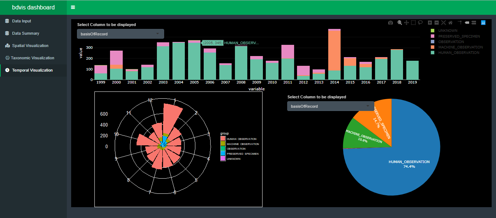

<!-- README.md is generated from README.Rmd. Please edit that file -->

# bdvisDashboard

<!-- badges: start -->

[](https://www.tidyverse.org/lifecycle/#experimental)
<!-- badges: end -->

The goal of bdvisDashboard is to provide an interactive shiny package
that allows user to visualize different aspect of bioDiversity data such
as temporal, taxonomic and spatial without worring about coding. This
package provides feature to upload and download datasets, a special tab
dedicated to view summary of data. User can also use pre-existing
datasets to get familiarize with bdvisDashboard without worring about
data. Each tab is dedicated to different field of visualization for easy
navigation.

## Installation

You can install the development version of bdvisDashboard from
[GitHub](https://github.com/) with:

``` r
# install.packages("devtools")
devtools::install_github("rahulchauhan049/bdvisDashboard")
```

``` r
library("bdvisDashboard)
```

## Using bdvisDashboard

Follow these steps to run bdvisDashboard

``` r
bdvisDashboard::run_app()
## Run the code to open bdvisDashboard
```

## bdvisDashboard Overview

### DataInput Tab

DataInput tab is dedicated for dataset selection. User can continue with
existing datasets or he can download a new dataset by clicking on
“Download Data” tab on dashboard. User can also upload their own
dataset.



### DataSummart Tab

DataSummary tab is made to give an overview of your dataset before
visualization. Missing Data in dataset can create a huge impact on
plots. Note that more the % of missing value, less you can trust the
result. This tab helps you to understand that how much you can trust the
visualizations.



### Spatial Tab

Spatial Tab is dedicated to space related visualizations such as
location, countries, etc. If you want to see data of a perticular
country, click on bar of that country. After that Aaa other plots will
show data collected from that country only. Note: Double click at black
area of bar chart to reset all graphs.



### Taxonomic Tab

Taxonomic Tab is to visualize the taxonomy of data. user can alos click
on bar chart to filter all other plots accordingly. User can select
different level of taxonomy from dropdown menu in bar chart.



### Temporal Tab

This tab is to visualize time related data. Click on a year in barchart
to filter data accordingly. User can alos select multiple years by using
selection box.




## We need your feedback :innocent:

Please submit your feedback using this **[link](https://github.com/rahulchauhan049/bdvisDashboard/issues/new)**

   :deciduous_tree: :mushroom: :shell: :fish: :frog: :honeybee: :turtle: :rooster: :whale2: :monkey: :octocat: 
