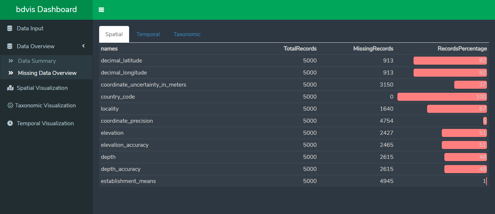
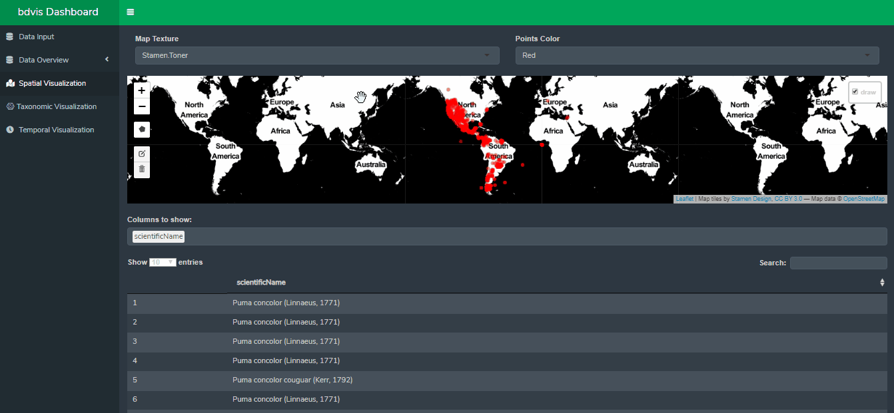
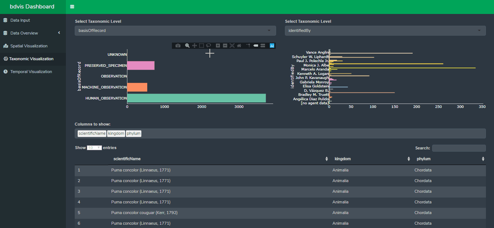
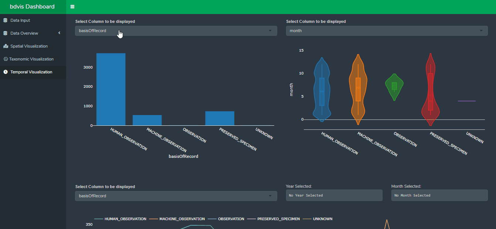

<!-- README.md is generated from README.Rmd. Please edit that file -->

# dashboard.demo

<!-- badges: start -->

[](https://www.tidyverse.org/lifecycle/#experimental)
<!-- badges: end -->

The goal of dashboard.demo is to provide an interactive shiny package
that allows user to visualize different aspect of bioDiversity data such
as temporal, taxonomic and spatial without worring about coding. This
package provides feature to upload and download datasets, a special tab
dedicated to view summary of data. User can also use pre-existing
datasets to get familiarize with dashboard.demo without worring about
data. Each tab is dedicated to different field of visualization for easy
navigation.

## Installation

You can install the development version of dashboard.demo from
[GitHub](https://github.com/) with:

``` r
# install.packages("devtools")
devtools::install_github("rahulchauhan049/dashboard.demo")
```

``` r
library("dashboard.demo)
```

## Using dashboard.demo

Follow these steps to run dashboard.demo

``` r
dashboard.demo::run_app()
## Run the code to open dashboard.demo
```

## dashboard.demo Overview

### DataInput Tab

DataInput tab is dedicated for dataset selection. Fill required fields and click on query Database to download records. User can also upload their own dataset.


### DataSummart Tab

DataSummary tab is made to give an overview of your dataset before
visualization. User can click on each tab to get summary of related fields.


### Missing Data Tab
This tab helps user to get % of missing records. Each tab contains related columns.



### Spatial Tab

Spatial Tab is dedicated to space related visualizations such as
location, countries, etc. If you want to see data of a perticular
country, click on bar of that country. After that Aaa other plots will
show data collected from that country only. Note: Double click at black
area of bar chart to reset all graphs.



### Taxonomic Tab

Taxonomic Tab is designed to visualize the taxonomy of data. Two bar graphs are used to filter the records. Select column of your choice and then click on records you want to filter data with.



### Temporal Tab

This tab is to visualize time related data. 




## We need your feedback :innocent:

Please submit your feedback using this **[link](https://github.com/rahulchauhan049/dashboard.demo/issues/new)**

   :deciduous_tree: :mushroom: :shell: :fish: :frog: :honeybee: :turtle: :rooster: :whale2: :monkey: :octocat: 
